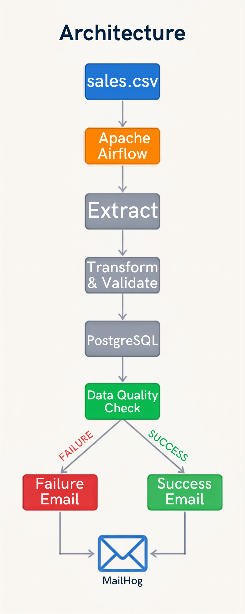
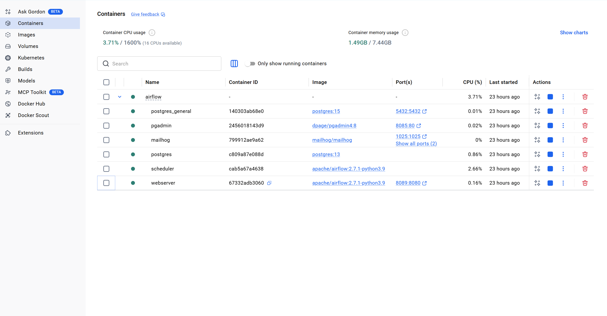
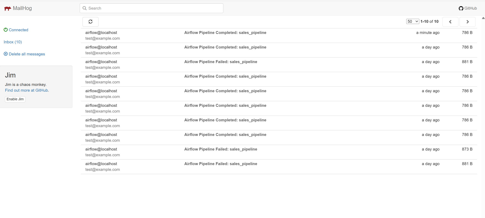
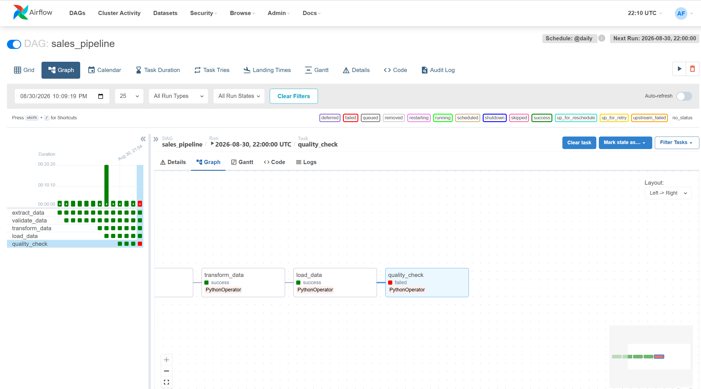
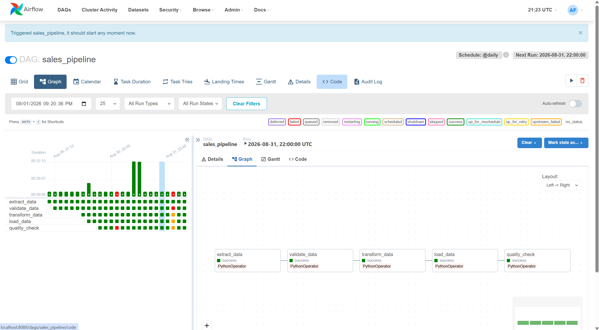

# Automated ETL Pipeline with Docker, Airflow & PostgreSQL

An end-to-end automated ETL pipeline built with **Python, Apache Airflow, PostgreSQL, Docker, Pandas, and MailHog**.

The project simulates a real-world Data Engineering workflow that extracts sales data from a CSV file, transforms and validates the data, loads it into PostgreSQL, performs data quality checks, and sends email notifications based on pipeline execution status.

## Architecture


## Technologies

* **Python** — Data processing and ETL logic
* **Pandas** — Data extraction and transformation
* **Apache Airflow** — Workflow orchestration and automation
* **PostgreSQL** — Data storage
* **Docker & Docker Compose** — Containerized environment
* **pgAdmin** — PostgreSQL database management
* **MailHog** — Local email testing and notifications
* **SQL** — Data loading and quality validation

## ETL Workflow

### 1. Extract

Sales data is extracted from:

```text
shared/sales.csv
```

using Python and Pandas.

### 2. Transform

The pipeline cleans and transforms the incoming data into a structured format suitable for PostgreSQL.

Typical operations include:

* Data type conversion
* Date parsing
* Data validation
* Handling invalid values
* Preparing records for database loading

### 3. Load

The processed data is loaded into PostgreSQL using an Airflow PostgreSQL connection.

### 4. Data Quality

The pipeline performs validation checks after loading the data.

For example, invalid negative prices are detected:

```sql
SELECT *
FROM sales_clean
WHERE price < 0;
```

If invalid data is detected, the pipeline fails.

### 5. Notifications

The pipeline sends notifications based on the execution result.

```text
Pipeline SUCCESS → Success Email
Pipeline FAILURE → Failure Email
```

MailHog is used as a local SMTP testing environment.

## Docker Services

The project runs multiple services using Docker Compose:

```text
Airflow Webserver
Airflow Scheduler
PostgreSQL
PostgreSQL General
pgAdmin
MailHog
```


This allows the complete ETL environment to run locally without installing each service directly on the host machine.

## Project Structure

```text
docker-airflow-postgresql-etl-automation/
│
├── dags/
│   └── sales_pipeline.py
│
├── shared/
│   └── sales.csv
│
├── airflow.yaml
├── requirements.txt
└── README.md
```

## Running the Project

Start the environment:

```bash
docker compose -f airflow.yaml up -d
```

Check the running containers:

```bash
docker compose -f airflow.yaml ps
```

Open Airflow:

```text
http://localhost:8089
```

Open pgAdmin:

```text
http://localhost:8085
```

Open MailHog:

```text
http://localhost:8025
```


Then trigger the `sales_pipeline` DAG from the Airflow interface.

## Testing Failure Handling

The pipeline can be tested by introducing invalid data into `sales.csv`.

For example:

```csv
1,2026-08-01,Ahmed,Laptop,1,-1200
```

After triggering the DAG, the Data Quality Check should detect the negative price and mark the relevant task as failed.




A failure notification should then appear in MailHog.

After testing, restore the valid value:

```csv
1,2026-08-01,Ahmed,Laptop,1,1200
```

Run the pipeline again to verify a successful execution.


## Key Data Engineering Concepts

This project demonstrates:

* ETL development
* Workflow orchestration
* Pipeline automation
* Data validation
* Data quality checks
* SQL
* PostgreSQL
* Docker containerization
* Airflow DAGs
* Error handling
* Success and failure notifications
* Local data engineering environment


